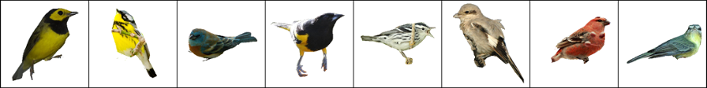
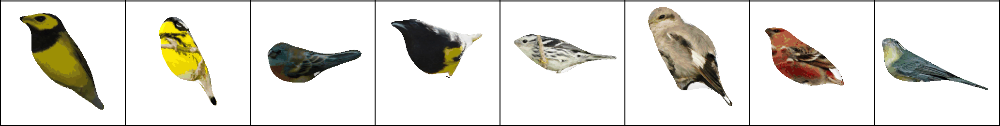

# Self-Supervised Mesh Reconstruction (SMR)
This is the source code of [Self-Supervised 3D Mesh Reconstruction From Single Images (CVPR-2021)](https://openaccess.thecvf.com/content/CVPR2021/papers/Hu_Self-Supervised_3D_Mesh_Reconstruction_From_Single_Images_CVPR_2021_paper.pdf).
<p float="left">
 

</p>

### Requirements
- Linux
- Python >= 3.6
- CUDA >= 10.0.130 (with `nvcc` installed)

## Installation
#### Create Environment
```sh
$ conda create --name smr python=3.7
$ conda activate smr
```

#### Install from requirements.txt
You can directly install the requirements through:
```sh
$ pip install -r requirements.txt
```

#### Install packages Seperately
You can also install the required packages seperately
* Pytorch
    ```sh
    $ conda install pytorch==1.6.0 torchvision==0.7.0 cudatoolkit=10.2 -c pytorch
    ```
* Kaolin Library
    ```sh
    $ git clone --recursive https://github.com/NVIDIAGameWorks/kaolin
    $ git checkout v0.9.0
    $ python setup.py develop
    ```

* Others: tqdm, trimesh, imageio, etc.

## Training and Testing
#### Training and Testing On the CUB-200-2011 (Bird) dataset

* Dataset
  
  Download the processed data from [Google Drive](https://drive.google.com/file/d/1SkX_FWUfLOaTr371TBkQnDH9oDJ5Khwc/view?usp=sharing).
* Run
    ```sh
    DATA_ROOT=/path/to/Bird/
    $ python train.py --imageSize 128 \
                        --batchSize 24 \
                        --lr 0.0001 \
                        --niter 500 \
                        --dataroot $DATA_ROOT \
                        --template_path ./template/sphere.obj \
                        --outf ./log/Bird/SMR \
                        --azi_scope 360 \
                        --elev_range '0~30' \
                        --dist_range '2~6' \
                        --lambda_gan 0.0001 \
                        --lambda_reg 1.0 \
                        --lambda_data 1.0 \
                        --lambda_ic 0.1 \
                        --lambda_lc 0.001
    ```
    or Multi-GPU
    ```sh
    python train.py --imageSize 256 \
                     --batchSize 24 \
                     --lr 0.0001 \
                     --niter 500 \
                     --dataroot $DATA_ROOT \
                     --template_path ./template/sphere.obj \
                     --outf ./log/Bird/SMR_256_2gpus_flip\
                     --azi_scope 360 \
                     --elev_range '0~30' \
                     --dist_range '2~6' \
                     --lambda_gan 0.0001 \
                     --lambda_reg 1.0 \
                     --lambda_data 1.0 \
                     --lambda_ic 0.1 \
                     --lambda_lc 0.001 \
                     --multigpus
    ```


## Contact
Tao Hu - [taohu@cse.cuhk.edu.hk](taohu@cse.cuhk.edu.hk)

## Citation
```
@InProceedings{Hu_2021_CVPR,
    author    = {Hu, Tao and Wang, Liwei and Xu, Xiaogang and Liu, Shu and Jia, Jiaya},
    title     = {Self-Supervised 3D Mesh Reconstruction From Single Images},
    booktitle = {Proceedings of the IEEE/CVF Conference on Computer Vision and Pattern Recognition (CVPR)},
    month     = {June},
    year      = {2021},
    pages     = {6002-6011}
}
```
